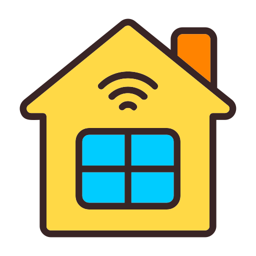

# 🏠 AI & IoT Nhà Thông Minh

<div align="center">
  
  
  
</div>

<h3 align="center">Hệ Thống Nhà Thông Minh Tích Hợp AI & IoT</h3>

<p align="center">
  <strong>Giải pháp giám sát và điều khiển thiết bị thông qua cảm biến và công nghệ kết nối không dây</strong>
</p>

<p align="center">
  <a href="#-kiến-trúc">Kiến trúc</a> •
  <a href="#-tính-năng-chính">Tính năng</a> •
  <a href="#-các-module">Các Module</a> •
  <a href="#-cài-đặt">Cài đặt</a> •
  <a href="#-hướng-dẫn-sử-dụng">Hướng dẫn sử dụng</a> •
  <a href="#-flask-server--web-html">Flask Server & Web HTML</a> •
  <a href="#-hệ-thống-phát-hiện-người">Hệ thống Phát Hiện Người</a> •
  <a href="#-tài-liệu">Tài liệu</a>
</p>

## 🏗️ Kiến trúc

Hệ thống được xây dựng theo mô hình phân tầng gồm:

1. **Lớp Cảm Biến & Thiết Bị (Edge Devices)**  
   Các module (Phòng Bếp, Phòng Khách, Phòng Ngủ, Cửa Ra Vào, …) sử dụng ESP32/ESP8266 kết nối với các cảm biến như DHT11, cảm biến khí gas, HC-SR04, cảm biến mưa, RFID,… và các thiết bị điều khiển như buzzer, quạt, LED, servo,…

2. **Lớp Giao Tiếp & Xử Lý Dữ Liệu**  
   Các module gửi dữ liệu qua WiFi đến Server Flask thông qua HTTP request để cập nhật trạng thái và nhận lệnh điều khiển.

3. **Lớp Server & Giao Diện Web**  
   - **Nhà Thông Minh:** Server Flask tiếp nhận và xử lý dữ liệu từ các module, cung cấp API điều khiển thiết bị và giao diện web hiển thị trạng thái.
   - **Phát Hiện Người:** Hệ thống riêng dùng ESP32-CAM, YOLO để phân tích hình ảnh, cập nhật trạng thái cảnh báo và cung cấp video stream; ESP8266 sẽ bật LED khi có cảnh báo. Giao diện web của hệ thống này hiển thị video và cảnh báo.

<p align="center">
  
</p>

## ✨ Tính năng chính

- **Giám sát môi trường đa phòng:**  
  - **Phòng Bếp:** Theo dõi nhiệt độ, độ ẩm, mức khí gas; kích hoạt báo động (buzzer, quạt, LED báo động) khi vượt ngưỡng an toàn.
  - **Phòng Khách:** Đo nhiệt độ, độ ẩm và phát hiện chuyển động (HC-SR04); điều khiển LED, quạt và cảm biến.
  - **Phòng Ngủ:** Giám sát nhiệt độ, độ ẩm, trạng thái mưa; điều khiển đèn, quạt và cửa sổ tự động (servo) – tự động đóng cửa sổ khi mưa.
  - **Cửa Ra Vào:** Xác thực truy cập qua thẻ RFID và bàn phím; mở/đóng cửa thông qua điều khiển servo và hiển thị thông báo trên LCD.

- **Điều khiển thiết bị từ xa:**  
  Đồng bộ trạng thái của các thiết bị (LED, quạt, cửa sổ, cảm biến) qua server và giao diện web.

- **Giao tiếp qua WiFi & HTTP:**  
  Mỗi module gửi và nhận dữ liệu từ Server Flask theo định dạng JSON qua các endpoint API.

- **Giao diện Web:**  
  Hiển thị dữ liệu cảm biến cập nhật theo thời gian thực và cung cấp các nút điều khiển cho từng phòng.

- **Hệ thống Phát Hiện Người (Bật LED):**  
  - **ESP32-CAM:** Thu hình và truyền dữ liệu qua WiFi.  
  - **Flask Server (YOLO):** Phân tích hình ảnh để phát hiện người và cập nhật trạng thái cảnh báo.  
  - **ESP8266:** Lấy trạng thái cảnh báo từ server và bật LED khi có người được phát hiện.  
  - **Giao diện Web:** Hiển thị video stream và thông báo khi phát hiện đối tượng.

## 📂 Các Module

### 1. Phòng Bếp

- **Chức năng:**  
  - Đo nhiệt độ, độ ẩm (DHT11) và mức khí gas.  
  - Hiển thị thông tin lên màn hình LCD I2C.  
  - Kích hoạt báo động (buzzer, quạt, LED báo động) khi nhiệt độ hoặc mức khí gas vượt ngưỡng.  
  - Đồng bộ trạng thái LED với server.

- **Thư viện sử dụng:**  
  - `WiFi.h`, `HTTPClient.h`, `LiquidCrystal_I2C.h`, `DHT.h`

- **Đoạn mã mẫu:**  
  ```cpp
  #include <WiFi.h>
  #include <HTTPClient.h>
  #include <LiquidCrystal_I2C.h>
  #include <DHT.h>

  // --- Cấu hình WiFi ---
  const char* ssid = "kevin kaslana";
  const char* password = "12345678";

  // Địa chỉ server Python (Flask)
  String serverIP = "192.168.82.9"; 
  String serverPort = "5000";
  String updateEndpoint = "http://192.168.82.9:5000/update";

  // --- Cấu hình cảm biến DHT11 ---
  #define DHTPIN 15
  #define DHTTYPE DHT11
  DHT dht(DHTPIN, DHTTYPE);

  // --- Khởi tạo LCD ---
  LiquidCrystal_I2C lcd(0x27, 16, 2);

  // --- Khai báo chân kết nối ---
  const int gasSensorPin = 34;    
  const int buzzerPin    = 16;    
  const int fanPin       = 17;    
  const int ledPin       = 18;    
  const int buttonPin    = 19;    

  // --- LED báo động ---
  const int ledAlarmPin  = 23;    
  bool ledAlarmState     = false; // Trạng thái LED 2 (báo động)

  // --- Ngưỡng ---
  const float tempThreshold = 30.0;
  const int gasThreshold = 6000;    
  const int gasHysteresis = 500;    

  // Hàm gửi dữ liệu cảm biến và trạng thái báo động cho phòng bếp
  void sendData(float temperature, float humidity, float gasPpm) {
    if (WiFi.status() == WL_CONNECTED) {
      HTTPClient http;
      String url = updateEndpoint + "?room=kitchen&temp=" + String(temperature) +
                   "&hum=" + String(humidity) +
                   "&gas=" + String(gasPpm) +
                   "&alarm=" + String(alarmState ? "ALERT" : "SAFE");
      http.begin(url);
      int httpResponseCode = http.GET();
      if (httpResponseCode > 0) {
        String response = http.getString();
        Serial.println("Server response: " + response);
      } else {
        Serial.print("Error code: ");
        Serial.println(httpResponseCode);
      }
      http.end();
    }
  }

  // ... (xem chi tiết trong code Phòng Bếp)
  ```

### 2. Phòng Khách

- **Chức năng:**  
  - Đo nhiệt độ, độ ẩm (DHT11) và phát hiện chuyển động qua cảm biến khoảng cách HC-SR04.  
  - Điều khiển LED và quạt theo lệnh từ server.  
  - Cập nhật trạng thái cảm biến (bật/tắt).

- **Thư viện sử dụng:**  
  - `ESP8266WiFi.h`, `ESP8266HTTPClient.h`, `DHT.h`

- **Đoạn mã mẫu:**  
  ```cpp
  #include <ESP8266WiFi.h>
  #include <ESP8266HTTPClient.h>
  #include <DHT.h>

  // --- Cấu hình WiFi ---
  const char* ssid = "kevin kaslana";
  const char* password = "12345678";

  // Địa chỉ server Python (Flask)
  String serverIP = "192.168.82.9"; 
  String serverPort = "5000";

  // Endpoint cập nhật dữ liệu cho phòng khách
  String livingRoomUpdateEndpoint = "http://" + serverIP + ":" + serverPort + "/update?room=living_room";
  // Các endpoint điều khiển
  String livingRoomSetLEDEndpoint    = "http://" + serverIP + ":" + serverPort + "/set_led?room=living_room&state=";
  String livingRoomSetFanEndpoint     = "http://" + serverIP + ":" + serverPort + "/set_fan?state=";
  String livingRoomSetSensorEndpoint  = "http://" + serverIP + ":" + serverPort + "/set_sensor?room=living_room&state=";
  String livingRoomGetLEDEndpoint     = "http://" + serverIP + ":" + serverPort + "/get_led?room=living_room";
  String livingRoomGetFanEndpoint      = "http://" + serverIP + ":" + serverPort + "/get_fan?room=living_room";
  String livingRoomGetSensorEndpoint   = "http://" + serverIP + ":" + serverPort + "/get_sensor?room=living_room";

  // ===== CẤU HÌNH CẢM BIẾN =====
  #define DHTPIN 14
  #define DHTTYPE DHT11
  DHT dht(DHTPIN, DHTTYPE);

  // HC-SR04
  const int trigPin = 5;
  const int echoPin = 4;

  // ===== CẤU HÌNH ĐIỆN RA =====
  const int led1Pin = 13;
  const int led2Pin = 15;
  const int fanPin    = 2;

  // Hàm gửi dữ liệu cảm biến cho phòng khách
  void sendLivingRoomData(float temperature, float humidity, float distance) {
    if (WiFi.status() == WL_CONNECTED) {
      HTTPClient http;
      WiFiClient client;
      String motionStr = motionDetected ? "YES" : "NO";
      String url = livingRoomUpdateEndpoint +
                   "&temp=" + String(temperature, 1) +
                   "&hum=" + String(humidity, 1) +
                   "&distance=" + String(distance, 1) +
                   "&motion=" + motionStr;
      http.begin(client, url);
      int httpResponseCode = http.GET();
      if (httpResponseCode > 0) {
        String response = http.getString();
        Serial.println("Living room update: " + response);
      } else {
        Serial.print("Error code: ");
        Serial.println(httpResponseCode);
      }
      http.end();
    }
  }

  // ... (xem chi tiết trong code Phòng Khách)
  ```

### 3. Phòng Ngủ

- **Chức năng:**  
  - Đo nhiệt độ, độ ẩm (DHT11) và theo dõi tình trạng mưa (Rain sensor).  
  - Điều khiển đèn LED, quạt và cửa sổ tự động (servo) theo dữ liệu cảm biến và lệnh từ server.
  - Tự động đóng cửa sổ khi mưa.

- **Thư viện sử dụng:**  
  - `ESP8266WiFi.h`, `ESP8266HTTPClient.h`, `DHT.h`, `Servo.h`

- **Đoạn mã mẫu:**  
  ```cpp
  #include <ESP8266WiFi.h>
  #include <ESP8266HTTPClient.h>
  #include <DHT.h>
  #include <Servo.h>

  // --- Cấu hình WiFi ---
  const char* ssid = "kevin kaslana";
  const char* password = "12345678";

  // Địa chỉ server Python (Flask)
  String serverIP = "192.168.82.9"; 
  String serverPort = "5000";
  String updateEndpoint = "http://192.168.82.9:5000/update";

  // ----- CẤU HÌNH CẢM BIẾN & ĐIỆN RA -----
  #define DHTPIN 14
  #define DHTTYPE DHT11
  DHT dht(DHTPIN, DHT11);

  #define RAINPIN D6
  #define LEDPIN 13
  #define FANPIN 16
  #define SERVO_PIN 5
  Servo windowServo;

  // Hàm gửi dữ liệu cảm biến cho phòng ngủ
  void sendBedroomData(float temperature, float humidity, bool isRaining) {
    if(WiFi.status() == WL_CONNECTED) {
      HTTPClient http;
      WiFiClient client;
      String rainStr = isRaining ? "RAIN" : "DRY";
      String url = updateEndpoint + "?room=bedroom&temp=" + String(temperature, 1) +
                   "&hum=" + String(humidity, 1) +
                   "&rain=" + rainStr;
      http.begin(client, url);
      int httpCode = http.GET();
      if(httpCode > 0) {
        String payload = http.getString();
        Serial.println("Bedroom update: " + payload);
      } else {
        Serial.print("Error code: ");
        Serial.println(httpCode);
      }
      http.end();
    }
  }

  // ... (xem chi tiết trong code Phòng Ngủ)
  ```

### 4. Cửa Ra Vào

- **Chức năng:**  
  - Xác thực truy cập bằng thẻ RFID và bàn phím ma trận.  
  - So sánh UID với danh sách hợp lệ để mở cửa.  
  - Hỗ trợ mở/đóng cửa qua mật khẩu nhập từ bàn phím.
  - Điều khiển servo mở/đóng cửa và hiển thị thông báo trên LCD.

- **Thư viện sử dụng:**  
  - `Keypad.h`, `Servo.h`, `LiquidCrystal_I2C.h`, `SPI.h`, `MFRC522.h`

- **Đoạn mã mẫu:**  
  ```cpp
  #include <Keypad.h>
  #include <Servo.h>
  #include <Wire.h>
  #include <LiquidCrystal_I2C.h>
  #include <SPI.h>
  #include <MFRC522.h>

  LiquidCrystal_I2C lcd(0x27, 16, 2);
  Servo myservo;

  #define SS_PIN A3
  #define RST_PIN 9

  #define MOSI_PIN 11
  #define MISO_PIN 12
  #define SCK_PIN 13

  #define SERVO_PIN A0
  #define LED_PIN A2

  MFRC522 mfrc522(SS_PIN, RST_PIN);

  // ... (xem chi tiết trong code Cửa Ra Vào)
  ```

## 📥 Cài đặt

### Yêu cầu phần cứng

- **Board điều khiển:** ESP32 hoặc ESP8266  
- **Cảm biến & Module:**  
  - DHT11 (cho Phòng Bếp, Phòng Khách, Phòng Ngủ)  
  - Cảm biến khí gas (Phòng Bếp)  
  - HC-SR04 (Phòng Khách)  
  - Cảm biến mưa (Phòng Ngủ)  
  - Module RFID RC522 và bàn phím ma trận (Cửa Ra Vào)
- **Thiết bị điều khiển:**  
  - LCD I2C (cho Phòng Bếp và Cửa Ra Vào)  
  - Buzzer, quạt, LED  
  - Servo (cho cửa sổ ở Phòng Ngủ và cửa ra vào)

### Yêu cầu phần mềm

- **Thư viện Arduino:**  
  - WiFi, HTTPClient, LiquidCrystal_I2C, DHT, Servo  
  - ESP8266WiFi, ESP8266HTTPClient  
  - Keypad, SPI, MFRC522
- **Python Flask Server:**  
  - Có 2 hệ thống: một cho Nhà Thông Minh và một cho Hệ thống Phát Hiện Người.
- **Giao diện Web:**  
  - HTML, CSS, JavaScript

### Hướng dẫn cài đặt

1. Cài đặt Arduino IDE và cấu hình board ESP32/ESP8266.
2. Cài đặt các thư viện cần thiết qua Library Manager hoặc tải trực tiếp.
3. Cập nhật SSID, mật khẩu, địa chỉ IP, cổng và các endpoint API trong từng module cho phù hợp với hệ thống của bạn.
4. Nạp chương trình lên các board tương ứng.

## 🚀 Flask Server & Web HTML (Nhà Thông Minh)

### Flask Server

```python
from flask import Flask, request, render_template, jsonify

app = Flask(__name__)

sensor_data = {
    "kitchen": {
        "temp": "N/A",
        "hum": "N/A",
        "gas": "N/A",
        "alarm": "SAFE",
        "led": "OFF"
    },
    "living_room": {
        "temp": "N/A",
        "hum": "N/A",
        "distance": "N/A",
        "motion": "NO",
        "led": "OFF",
        "fan": "OFF",
        "sensor": "YES"
    },
    "bedroom": {
        "temp": "N/A",
        "hum": "N/A",
        "rain": "DRY",
        "led": "OFF",
        "fan": "OFF",
        "window": "CLOSED"
    }
}

@app.route('/update')
def update():
    room = request.args.get('room', 'kitchen')
    if room == "kitchen":
        temp = request.args.get('temp')
        hum = request.args.get('hum')
        gas = request.args.get('gas')
        alarm = request.args.get('alarm')
        if temp and hum and gas and alarm:
            sensor_data["kitchen"].update({
                "temp": temp,
                "hum": hum,
                "gas": gas,
                "alarm": alarm
            })
            return "Kitchen Data Updated", 200
        return "Missing parameters", 400
    elif room == "living_room":
        temp = request.args.get('temp')
        hum = request.args.get('hum')
        distance = request.args.get('distance')
        motion = request.args.get('motion')
        if temp and hum and distance and motion:
            led = sensor_data["living_room"].get("led", "OFF")
            fan = sensor_data["living_room"].get("fan", "OFF")
            sensor = sensor_data["living_room"].get("sensor", "YES")
            sensor_data["living_room"].update({
                "temp": temp,
                "hum": hum,
                "distance": distance,
                "motion": motion,
                "led": led,
                "fan": fan,
                "sensor": sensor
            })
            return "Living Room Data Updated", 200
        return "Missing parameters", 400
    elif room == "bedroom":
        temp = request.args.get('temp')
        hum = request.args.get('hum')
        rain = request.args.get('rain')
        if temp and hum and rain:
            led = sensor_data["bedroom"].get("led", "OFF")
            fan = sensor_data["bedroom"].get("fan", "OFF")
            window = sensor_data["bedroom"].get("window", "CLOSED")
            sensor_data["bedroom"].update({
                "temp": temp,
                "hum": hum,
                "rain": rain,
                "led": led,
                "fan": fan,
                "window": window
            })
            return "Bedroom Data Updated", 200
        return "Missing parameters", 400

@app.route('/set_led')
def set_led():
    room = request.args.get('room', 'kitchen')
    state = request.args.get('state')
    if state:
        if room in sensor_data and "led" in sensor_data[room]:
            sensor_data[room]["led"] = "ON" if state.lower() == "on" else "OFF"
            return "LED state updated", 200
        return "Invalid room", 400
    return "Missing parameter", 400

@app.route('/set_fan')
def set_fan():
    room = request.args.get('room', 'living_room')
    state = request.args.get('state')
    if state:
        if room in sensor_data and "fan" in sensor_data[room]:
            sensor_data[room]["fan"] = "ON" if state.lower() == "on" else "OFF"
            return "Fan state updated", 200
        return "Invalid room", 400
    return "Missing parameter", 400

@app.route('/set_window')
def set_window():
    room = request.args.get('room', 'bedroom')
    state = request.args.get('state')
    if state and room == "bedroom":
        sensor_data["bedroom"]["window"] = "OPEN" if state.lower() == "open" else "CLOSED"
        return "Window state updated", 200
    return "Missing parameter", 400

@app.route('/set_sensor')
def set_sensor():
    room = request.args.get('room', 'living_room')
    state = request.args.get('state')
    if state:
        if room in sensor_data and "sensor" in sensor_data[room]:
            sensor_data[room]["sensor"] = "YES" if state.lower() == "on" else "NO"
            return "Sensor state updated", 200
        return "Invalid room", 400
    return "Missing parameter", 400

@app.route('/get_led')
def get_led():
    room = request.args.get('room', 'kitchen')
    if room in sensor_data and "led" in sensor_data[room]:
        return jsonify({"led": sensor_data[room]["led"]})
    return jsonify({"led": "N/A"})

@app.route('/get_fan')
def get_fan():
    room = request.args.get('room', 'living_room')
    if room in sensor_data and "fan" in sensor_data[room]:
        return jsonify({"fan": sensor_data[room]["fan"]})
    return jsonify({"fan": "N/A"})

@app.route('/get_window')
def get_window():
    room = request.args.get('room', 'bedroom')
    if room in sensor_data and "window" in sensor_data[room]:
        return jsonify({"window": sensor_data[room]["window"]})
    return jsonify({"window": "N/A"})

@app.route('/get_sensor')
def get_sensor():
    room = request.args.get('room', 'living_room')
    if room in sensor_data and "sensor" in sensor_data[room]:
        return jsonify({"sensor": sensor_data[room]["sensor"]})
    return jsonify({"sensor": "N/A"})

@app.route('/')
def index():
    return render_template('index.html', sensor_data=sensor_data)

if __name__ == '__main__':
    app.run(host='0.0.0.0', port=5000)
```

### Giao diện Web HTML (Nhà Thông Minh)

```html
<!DOCTYPE html>
<html>
<head>
    <meta charset="UTF-8">
    <title>Quản lý Nhà Thông Minh</title>
    <style>
        body { font-family: 'Segoe UI', Tahoma, Geneva, Verdana, sans-serif; background-color: #f0f2f5; margin: 0; padding: 0; }
        .container { max-width: 400px; margin: 2rem auto; background-color: #fff; padding: 1.5rem; border-radius: 8px; box-shadow: 0 0 10px rgba(0,0,0,0.1); margin-bottom: 2rem; }
        h1 { text-align: center; margin-bottom: 1rem; }
        p { font-size: 1rem; margin: 0.5rem 0; }
        button { display: inline-block; background-color: #007bff; color: #fff; padding: 0.6rem 1rem; border: none; border-radius: 4px; cursor: pointer; font-size: 1rem; margin-right: 0.5rem; }
        button:hover { background-color: #0056b3; }
        button[disabled] { opacity: 0.6; cursor: not-allowed; }
        .alert { color: #dc3545; font-weight: bold; }
        .safe { color: #28a745; font-weight: bold; }
    </style>
    <script>
      // Các hàm điều khiển phòng từ API của Flask
      function toggleKitchenLED(){ /* ... */ }
      function toggleLivingLED(){ /* ... */ }
      function toggleLivingFan(){ /* ... */ }
      function toggleLivingSensor(){ /* ... */ }
      function toggleBedroomLED(){ /* ... */ }
      function toggleBedroomFan(){ /* ... */ }
      function toggleBedroomWindow(){ /* ... */ }
      setTimeout(function(){ window.location.reload(); }, 5000);
    </script>
</head>
<body>
    <!-- PHÒNG BẾP -->
    <div class="container">
        <h1>Phòng Bếp</h1>
        <p>Nhiệt độ: {{ sensor_data.kitchen.temp }} °C</p>
        <p>Độ ẩm: {{ sensor_data.kitchen.hum }} %</p>
        <p>Nồng độ khí gas: {{ sensor_data.kitchen.gas }} ppm</p>
        <p>Tình trạng báo động: 
            
               <span class="alert">{{ sensor_data.kitchen.alarm }}</span>
            
               <span class="safe">{{ sensor_data.kitchen.alarm }}</span>
            
        </p>
        <p>Đèn LED chính: <span id="kitchen_led">{{ sensor_data.kitchen.led }}</span></p>
        <button onclick="toggleKitchenLED()"
           disabled >
          
             KHÓA
          
              TẮT ĐÈN  BẬT ĐÈN 
          
        </button>
    </div>
    <!-- PHÒNG KHÁCH -->
    <div class="container">
        <h1>Phòng Khách</h1>
        <p>Nhiệt độ: {{ sensor_data.living_room.temp }} °C</p>
        <p>Độ ẩm: {{ sensor_data.living_room.hum }} %</p>
        <p>Khoảng cách: {{ sensor_data.living_room.distance }} cm</p>
        <p>Chuyển động: {{ sensor_data.living_room.motion }}</p>
        <p>Đèn LED: <span id="living_led">{{ sensor_data.living_room.led }}</span></p>
        <p>Quạt: <span id="living_fan">{{ sensor_data.living_room.fan }}</span></p>
        <p>Cảm biến HC-SR04: <span id="living_sensor">
             BẬT  TẮT 
        </span></p>
        <button onclick="toggleLivingLED()">
             TẮT ĐÈN  BẬT ĐÈN 
        </button>
        <button onclick="toggleLivingFan()">
             TẮT QUẠT  BẬT QUẠT 
        </button>
        <button onclick="toggleLivingSensor()">
             TẮT CẢM BIẾN  BẬT CẢM BIẾN 
        </button>
    </div>
    <!-- PHÒNG NGỦ -->
    <div class="container">
        <h1>Phòng Ngủ</h1>
        <p>Nhiệt độ: {{ sensor_data.bedroom.temp }} °C</p>
        <p>Độ ẩm: {{ sensor_data.bedroom.hum }} %</p>
        <p>Mưa: {{ sensor_data.bedroom.rain }}</p>
        <p>Đèn LED: <span id="bedroom_led">{{ sensor_data.bedroom.led }}</span></p>
        <p>Quạt: <span id="bedroom_fan">{{ sensor_data.bedroom.fan }}</span></p>
        <p>Cửa sổ: <span id="bedroom_window">{{ sensor_data.bedroom.window }}</span></p>
        <button onclick="toggleBedroomLED()">
             TẮT ĐÈN  BẬT ĐÈN 
        </button>
        <button onclick="toggleBedroomFan()">
             TẮT QUẠT  BẬT QUẠT 
        </button>
        <button onclick="toggleBedroomWindow()">
             ĐÓNG CỬA SỔ  MỞ CỬA SỔ 
        </button>
    </div>
</body>
</html>
```

## 🚀 Hệ thống Phát Hiện Người (Bật LED)

### ESP32-CAM

```cpp
#include "esp_camera.h"
#include <WiFi.h>
#include "camera_pins.h"

const char* ssid = "kevin kaslana";
const char* password = "12345678";

void startCameraServer();
void setupLedFlash(int pin);

void setup() {
  Serial.begin(115200);
  camera_config_t config;
  // Cấu hình camera (chỉnh theo yêu cầu)
  config.ledc_channel = LEDC_CHANNEL_0;
  config.ledc_timer = LEDC_TIMER_0;
  config.pin_d0 = Y2_GPIO_NUM;
  config.pin_d1 = Y3_GPIO_NUM;
  config.pin_d2 = Y4_GPIO_NUM;
  config.pin_d3 = Y5_GPIO_NUM;
  config.pin_d4 = Y6_GPIO_NUM;
  config.pin_d5 = Y7_GPIO_NUM;
  config.pin_d6 = Y8_GPIO_NUM;
  config.pin_d7 = Y9_GPIO_NUM;
  config.pin_xclk = XCLK_GPIO_NUM;
  config.pin_pclk = PCLK_GPIO_NUM;
  config.pin_vsync = VSYNC_GPIO_NUM;
  config.pin_href = HREF_GPIO_NUM;
  config.pin_sccb_sda = SIOD_GPIO_NUM;
  config.pin_sccb_scl = SIOC_GPIO_NUM;
  config.pin_pwdn = PWDN_GPIO_NUM;
  config.pin_reset = RESET_GPIO_NUM;
  config.xclk_freq_hz = 20000000;
  config.frame_size = FRAMESIZE_UXGA;
  config.pixel_format = PIXFORMAT_JPEG;
  config.grab_mode = CAMERA_GRAB_WHEN_EMPTY;
  config.fb_location = CAMERA_FB_IN_PSRAM;
  config.jpeg_quality = 12;
  config.fb_count = 1;

  if (config.pixel_format == PIXFORMAT_JPEG) {
    if (psramFound()) {
      config.jpeg_quality = 10;
      config.fb_count = 2;
      config.grab_mode = CAMERA_GRAB_LATEST;
    } else {
      config.frame_size = FRAMESIZE_SVGA;
      config.fb_location = CAMERA_FB_IN_DRAM;
    }
  } else {
    config.frame_size = FRAMESIZE_240X240;
  }

  esp_err_t err = esp_camera_init(&config);
  if (err != ESP_OK) {
    Serial.printf("Camera init failed with error 0x%x", err);
    return;
  }

  sensor_t *s = esp_camera_sensor_get();
  if (s->id.PID == OV3660_PID) {
    s->set_vflip(s, 1);
    s->set_brightness(s, 1);
    s->set_saturation(s, -2);
  }
  if (config.pixel_format == PIXFORMAT_JPEG) {
    s->set_framesize(s, FRAMESIZE_QVGA);
  }
#if defined(LED_GPIO_NUM)
  setupLedFlash(LED_GPIO_NUM);
#endif

  WiFi.begin(ssid, password);
  while (WiFi.status() != WL_CONNECTED) {
    delay(500);
    Serial.print(".");
  }
  Serial.println("WiFi connected");
  startCameraServer();
  Serial.print("Camera Ready! Use 'http://");
  Serial.print(WiFi.localIP());
  Serial.println("' to connect");
}

void loop() {
  delay(10000);
}
```

### Flask Server (Phát Hiện Người với YOLO)

```python
from ultralytics import YOLO
import cv2
from urllib.request import urlopen
import numpy as np
from flask import Flask, Response, render_template, jsonify

app = Flask(__name__)
model = YOLO("yolo11n.pt")
url = r'http://192.168.82.42/capture'
alert_status = False  

def generate_frames():
    global alert_status
    while True:
        try:
            img_resp = urlopen(url)
            imgnp = np.asarray(bytearray(img_resp.read()), dtype="uint8")
            frame = cv2.imdecode(imgnp, -1)
            
            results = model(frame)
            alert_status = False
            
            for result in results:
                for box in result.boxes:
                    x1, y1, x2, y2 = map(int, box.xyxy[0])
                    confidence = box.conf[0].item()
                    class_id = int(box.cls[0])
                    if class_id == 0:
                        alert_status = True
                        cv2.rectangle(frame, (x1, y1), (x2, y2), (0, 255, 0), 2)
                        cv2.putText(frame, f'Person {confidence:.2f}', (x1, y1 - 10),
                                    cv2.FONT_HERSHEY_SIMPLEX, 0.5, (0, 255, 0), 2)
            
            _, buffer = cv2.imencode('.jpg', frame)
            frame_bytes = buffer.tobytes()
            yield (b'--frame\r\n'
                   b'Content-Type: image/jpeg\r\n\r\n' + frame_bytes + b'\r\n')
        except Exception as e:
            print(f"Error: {e}")
            continue

@app.route('/')
def index():
    return render_template("index.html")

@app.route('/video_feed')
def video_feed():
    return Response(generate_frames(), mimetype='multipart/x-mixed-replace; boundary=frame')

@app.route('/alert_status')
def alert_status_route():
    global alert_status
    return jsonify({"alert": alert_status})

if __name__ == "__main__":
    app.run(host='0.0.0.0', port=5000, debug=True)
```

### ESP8266 (Bật LED theo trạng thái cảnh báo)

```cpp
#include <ESP8266WiFi.h>
#include <ESP8266HTTPClient.h>

const char* ssid = "kevin kaslana";
const char* password = "12345678";
const char* serverUrl = "http://192.168.82.9:5000/alert_status";
const int LED_PIN = D2;
bool ledState = false;
unsigned long lastDetected = 0;
const unsigned long ledTimeout = 5000;
WiFiClient wifiClient;

void setup() {
    Serial.begin(115200);
    WiFi.begin(ssid, password);
    pinMode(LED_PIN, OUTPUT);
    digitalWrite(LED_PIN, LOW);
    while (WiFi.status() != WL_CONNECTED) {
        delay(500);
        Serial.print(".");
    }
    Serial.println("\nConnected to WiFi!");
}

void loop() {
    if (WiFi.status() == WL_CONNECTED) {
        HTTPClient http;
        http.begin(wifiClient, serverUrl);
        int httpCode = http.GET();
        if (httpCode == HTTP_CODE_OK) {
            String payload = http.getString();
            if (payload.indexOf("\"alert\": true") > 0) {
                digitalWrite(LED_PIN, HIGH);
                ledState = true;
                lastDetected = millis();
            } 
        }
        http.end();
    }
    if (ledState && millis() - lastDetected > ledTimeout) {
        digitalWrite(LED_PIN, LOW);
        ledState = false;
    }
    delay(1000);
}
```

### Giao diện Web (Phát Hiện Người)

```html
<!DOCTYPE html>
<html lang="vi">
<head>
    <meta charset="UTF-8">
    <meta name="viewport" content="width=device-width, initial-scale=1.0">
    <title>YOLO - Phát đối tượng (Người)</title>
    <style>
        body {
            text-align: center;
            background-color: #222;
            color: white;
            font-family: Arial, sans-serif;
        }
        h1 { margin-top: 20px; }
        img { border: 2px solid white; margin-top: 10px; }
        #alert {
            margin-top: 15px;
            padding: 10px;
            font-size: 20px;
            font-weight: bold;
            display: none;
            color: red;
        }
    </style>
</head>
<body>
    <h1>YOLO - Phát hiện đối tượng (Người)</h1>
    
    <div id="alert">🚨 Phát hiện đối tượng! 🚨</div>
    <script>
          function checkAlert() {
              fetch('/alert_status')
                  .then(response => response.json())
                  .then(data => {
                      let alertDiv = document.getElementById("alert");
                      alertDiv.style.display = data.alert ? "block" : "none";
                  });
          }
          setInterval(checkAlert, 500);
    </script>
</body>
</html>
```

## 🚀 Hướng dẫn sử dụng

- **Sau khi nạp chương trình cho các module Nhà Thông Minh:**  
  Các board (Phòng Bếp, Phòng Khách, Phòng Ngủ, Cửa Ra Vào) tự động kết nối WiFi và gửi dữ liệu cảm biến về Flask Server, đồng bộ trạng thái thiết bị và hiển thị trên giao diện web.

- **Hệ thống Phát Hiện Người:**  
  - ESP32-CAM thu hình và truyền dữ liệu về Flask Server sử dụng YOLO để phân tích hình ảnh.  
  - Flask Server cập nhật trạng thái cảnh báo và cung cấp video stream.  
  - ESP8266 liên tục lấy trạng thái từ server và bật LED khi có cảnh báo.  
  - Giao diện web hiển thị video stream và cảnh báo khi phát hiện người.

## 📚 Tài liệu

- [Code phần nhà thông minh](Cam_nhan_dien_nguoi_bat_den)
- [Code phần hệ thống nhận diện người bật đèn](Main_House)

## 📝 License

© 2024 AIoTLab – Faculty of Information Technology, DaiNam University.  
Tất cả các quyền được bảo lưu.

---

<div align="center">
  <p>Được xây dựng với 💡 bởi AIoTLab tại Đại Học Đà Nẵng</p>
  <p>
    <a href="https://fit.dainam.edu.vn">Website</a> • 
    <a href="https://github.com/drkhanusa">GitHub</a> • 
    <a href="mailto:contact@dainam.edu.vn">Liên hệ</a>
  </p>
</div>
