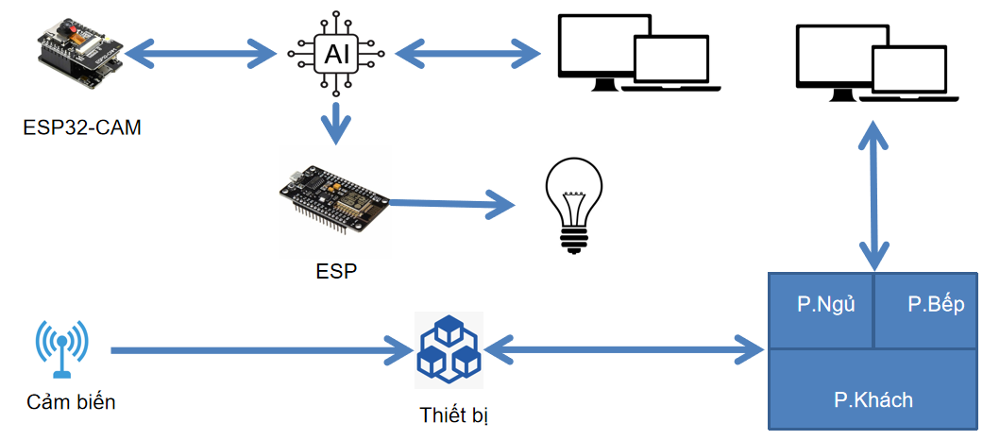

<h1 align="center"> 🏠 HỆ THỐNG NHÀ THÔNG MINH TÍCH HỢP AI & IOT</h1>

<div align="center">
  
  <p align="center">
    
    
  </p>

  [](https://www.facebook.com/DNUAIoTLab)
  [](https://fitdnu.net/)
  [](https://dainam.edu.vn)

</div>

<h2 align="center">Giải pháp giám sát & điều khiển thông minh trong ngôi nhà hiện đại</h2>

<p align="left">
  Hệ thống Nhà Thông Minh tích hợp công nghệ AI và IoT, cho phép giám sát môi trường và điều khiển các thiết bị trong nhà một cách tự động. Dự án kết hợp phần cứng (ESP32/ESP8266, cảm biến, RFID, LCD, servo, LED, buzzer, v.v...) với phần mềm (Flask Server, giao diện Web, YOLO cho phát hiện người) để tạo ra một hệ thống điều khiển và giám sát toàn diện.
</p>

---

## 🌟 GIỚI THIỆU

- **Giám sát đa phòng:** Hệ thống thu thập dữ liệu từ các phòng (Bếp, Khách, Ngủ, Cửa Ra Vào) với các cảm biến nhiệt độ, độ ẩm, khí gas, chuyển động, mưa, và sử dụng RFID để quản lý truy cập.
- **Điều khiển từ xa:** Trạng thái thiết bị được đồng bộ qua WiFi về Server Flask, cho phép điều khiển từ giao diện Web.
- **Phát hiện người:** Một hệ thống riêng biệt sử dụng ESP32-CAM, YOLO và ESP8266 để phát hiện người trong không gian, từ đó kích hoạt LED cảnh báo.
- **Giao diện trực quan:** Giao diện web hiển thị dữ liệu cảm biến cập nhật theo thời gian thực và cho phép người dùng điều khiển thiết bị từ xa.

---

## 🏗️ HỆ THỐNG

<p align="center">
  
</p>

- **Lớp Cảm Biến & Thiết Bị (Edge Devices):** Các module ở từng phòng sử dụng ESP32/ESP8266 để thu thập dữ liệu từ cảm biến và điều khiển thiết bị (LED, quạt, servo, buzzer…).
- **Lớp Giao Tiếp & Xử Lý Dữ Liệu:** Dữ liệu được gửi qua WiFi về Server Flask thông qua các API RESTful.
- **Lớp Server & Giao Diện Web:** Flask Server xử lý dữ liệu, lưu trữ trạng thái và cung cấp giao diện điều khiển qua Web. Hệ thống phát hiện người cũng có server riêng với video stream và trạng thái cảnh báo.

---

## 📂 CẤU TRÚC DỰ ÁN

```
Project
├── docs/
│   ├── images/                 # Hình ảnh minh họa, logo, sơ đồ hệ thống
│   │   ├── logo.png
│   │   ├── AIoTLab_logo.png
│   │   └── image.png
├── modules/
│   ├── kitchen/                # Code cho Phòng Bếp
│   │   └── Phong.bepp.ino
│   ├── living_room/            # Code cho Phòng Khách
│   │   └── Phong_khachhh.ino
│   ├── bedroom/                # Code cho Phòng Ngủ
│   │   └── PHONG_NGU.ino
│   └── door/                   # Code cho Cửa Ra Vào
│       └── _9Control_Led_Icd_Pasword.ino
├── server_smart_home/
│   ├── app.py                  # Flask Server của Nhà Thông Minh
│   └── templates/
│       └── index.html         # Giao diện Web điều khiển hệ thống
├── people_detection/
│   ├── esp32_cam/              # Code cho ESP32-CAM (thu hình)
│   │   └── eCameraWebServer.ino
│   ├── server_people/          # Flask Server với YOLO, video stream, cảnh báo
│   │   └── cam.py
│   ├── esp8266_led/           # Code cho ESP8266 bật LED theo trạng thái cảnh báo
│   │   └── ESP8266-BTL-CAM.ino
│   └── templates/
│       └── index.html         # Giao diện Web cho hệ thống phát hiện người
├── README.md                   # Tệp hướng dẫn dự án (bạn đang xem)
└── docs/
    ├── installation.md        # Hướng dẫn cài đặt chi tiết
    └── user-manual.md         # Hướng dẫn sử dụng giao diện & API
```

---

## 🛠️ CÔNG NGHỆ SỬ DỤNG

<div align="center">

### 📡 Phần cứng
[](https://www.espressif.com/)
[](https://www.espressif.com/)
[](https://www.arduino.cc/)
[](https://github.com/miguelbalboa/rfid)
[](https://www.ai-thinker.com/)

### 🖥️ Phần mềm
[]()
[]()
[]()
[]()
</div>

---

## 🛠️ YÊU CẦU HỆ THỐNG

### 🔌 Phần cứng
- **ESP32/ESP8266:** Dùng để lập trình các module cảm biến.
- **Cảm biến:**  
  - DHT11 (nhiệt độ, độ ẩm)
  - Cảm biến khí gas (Phòng Bếp)
  - HC-SR04 (Phòng Khách)
  - Cảm biến mưa (Phòng Ngủ)
  - RFID RC522 và bàn phím ma trận (Cửa Ra Vào)
  - ESP32-CAM (cho phát hiện người)
- **Thiết bị điều khiển:**  
  - LCD I2C
  - LED, buzzer, quạt, servo

### 💻 Phần mềm
- **Python 3+**
- **Flask Framework**
- **Thư viện YOLO (ultralytics)** và OpenCV cho hệ thống phát hiện người

---

## 🧩 BẢNG CHÂN KẾT NỐI PHẦN CỨNG THEO PHÒNG

### Phòng Bếp
| Thiết bị         | Pin/Connection                    | Chức năng                                  |
|------------------|-----------------------------------|--------------------------------------------|
| DHT11            | GPIO 15                           | Đo nhiệt độ và độ ẩm                        |
| Gas Sensor       | Analog Input GPIO 34              | Đo nồng độ khí gas                         |
| LCD I2C          | SDA, SCL (địa chỉ 0x27)            | Hiển thị thông tin                         |
| Buzzer           | Digital Pin 16                    | Báo động khi phát hiện nguy cơ              |
| Fan              | Digital Pin 17                    | Điều khiển quạt                             |
| LED (User)       | Digital Pin 18                    | Hiển thị trạng thái điều khiển từ server     |
| Nút bấm          | Digital Pin 19 (INPUT_PULLUP)     | Cho phép bật/tắt LED theo yêu cầu           |
| LED Báo động     | Digital Pin 23                    | Báo hiệu trạng thái nguy cơ (ALERT)         |

### Phòng Khách
| Thiết bị         | Pin/Connection                    | Chức năng                                  |
|------------------|-----------------------------------|--------------------------------------------|
| DHT11            | GPIO 14                           | Đo nhiệt độ và độ ẩm                        |
| HC-SR04          | Trig: GPIO 5, Echo: GPIO 4         | Phát hiện chuyển động                        |
| LED1             | Digital Pin 13                    | Điều khiển (bật/tắt) từ server              |
| LED2             | Digital Pin 15                    | Báo hiệu chuyển động (auto bật khi có người) |
| Fan              | Digital Pin 2                     | Điều khiển quạt                             |

### Phòng Ngủ
| Thiết bị         | Pin/Connection                    | Chức năng                                  |
|------------------|-----------------------------------|--------------------------------------------|
| DHT11            | GPIO 14                           | Đo nhiệt độ và độ ẩm                        |
| Rain Sensor      | Digital Pin D6                    | Phát hiện mưa                              |
| LED              | Digital Pin 13                    | Điều khiển (bật/tắt) từ server              |
| Fan              | Digital Pin 16                    | Điều khiển quạt                             |
| Servo (Window)   | Digital Pin 5                     | Điều khiển mở/đóng cửa sổ (window)           |

### Cửa Ra Vào
| Thiết bị         | Pin/Connection                                | Chức năng                                  |
|------------------|-----------------------------------------------|--------------------------------------------|
| RFID Module      | SS: A3, RST: 9, SPI: MOSI=11, MISO=12, SCK=13  | Xác thực thẻ RFID                          |
| Keypad           | Rows: {2,3,4,5}, Cols: {6,7,8,A1}              | Nhập mật khẩu mở/đóng cửa                  |
| Servo            | Digital Pin A0                                | Điều khiển mở/đóng cửa                      |
| LED (Báo hiệu)   | Digital Pin A2                                | Hiển thị trạng thái (tùy chọn)               |

### Hệ thống Phát Hiện Người (Bật LED)
| Thiết bị           | Pin/Connection                          | Chức năng                                       |
|--------------------|-----------------------------------------|-------------------------------------------------|
| ESP32-CAM          | Theo cấu hình trong `camera_pins.h`     | Thu hình, truyền dữ liệu qua WiFi, phát hiện người bằng YOLO  |
| ESP8266 (LED)      | Digital Pin D2                          | Bật LED khi nhận trạng thái cảnh báo từ Flask Server (Phát Hiện Người)  |

---

## 🚀 HƯỚNG DẪN CÀI ĐẶT & CHẠY

### 1. Nạp chương trình cho các module
- **Sử dụng Arduino IDE:**  
  Mở từng file mã nguồn trong thư mục `Main_House/` (`Phong_bep_uno/Phong.bepp.ino`, `Phong_khach_uno/Phong_khachhh.ino`, `Phong_ngu_uno/PHONG_NGU.ino`, `Cua_ra_vao_uno/_9Control_Led_Icd_Pasword.ino`) và nạp lên board tương ứng.
- **ESP32-CAM:**  
  Mở file `CameraWebServer/CameraWebServer.ino` và nạp lên board ESP32-CAM.
- **ESP8266 (Phát Hiện Người – LED):**  
  Nạp file `ESP8266-BTL-CAM/ESP8266-BTL-CAM.ino` lên board ESP8266.

### 2. Cài đặt Python và các thư viện cần thiết
Cài đặt Python 3 và sau đó cài đặt các thư viện bằng lệnh:
```bash
pip install flask pyserial pymongo opencv-python ultralytics numpy
```

### 3. Cấu hình Server
- **Flask Server (Nhà Thông Minh):**  
  Chạy file `Server_main_house/app.py`:
  ```bash
  python app.py
  ```
- **Flask Server (Phát Hiện Người):**  
  Chạy file `Server_cam/cam.py`:
  ```bash
  python cam.py
  ```

### 4. Chạy giao diện quản lý (nếu có)
- Mở trình duyệt và truy cập vào `http://localhost:5000` để xem giao diện của Nhà Thông Minh.
- Với hệ thống phát hiện người, truy cập vào URL tương ứng (ví dụ: `http://localhost:5000`) để xem video stream và cảnh báo.

---

## 📖 HƯỚNG DẪN SỬ DỤNG

1. **Giám sát & điều khiển nhà thông minh:**
   - Các module tự động gửi dữ liệu cảm biến lên Flask Server.
   - Giao diện Web hiển thị thông tin từng phòng và cho phép điều khiển từ xa (bật/tắt LED, quạt, cửa sổ…).

2. **Phát hiện người:**
   - ESP32-CAM thu hình và gửi dữ liệu về Flask Server chạy YOLO để phân tích.
   - Khi phát hiện người, trạng thái cảnh báo được cập nhật và ESP8266 sẽ bật LED.
   - Giao diện Web của hệ thống phát hiện người hiển thị video stream và thông báo cảnh báo.

---

## ⚙️ CẤU HÌNH & GHI CHÚ

1. **Cổng kết nối Arduino:**  
   Mặc định cổng COM được cấu hình trong file Python (có thể điều chỉnh nếu cần).
2. **Cấu hình WiFi:**  
   Cập nhật SSID, mật khẩu trong các file mã nguồn (Arduino & ESP32-CAM, ESP8266).
3. **Endpoint API:**  
   Đảm bảo các endpoint trên Flask Server được cập nhật chính xác với địa chỉ IP và cổng của máy chủ.
4. **Thời gian cập nhật:**  
   Các module gửi dữ liệu định kỳ, giao diện Web tự động refresh sau 5 giây.

---

## 📰 POSTER & TÀI LIỆU

<p align="center">
  
</p>

---

## 🤝 ĐÓNG GÓP

Dự án được phát triển bởi:
| Họ và Tên        | Vai trò                                                    |
|------------------|------------------------------------------------------------|
| Vũ Văn Hiệp      | Phát triển mã nguồn, thiết kế hệ thống, thiết kế giao diện |
| Trần Thị Thu Lan | Phát triển mã nguồn, soạn thảo tài liệu, thiết kế mô hình  |
| Xa Đức Đồng      | Thiết kế giao diện, thiết kế mô hình, hỗ trợ kỹ thuật      |
| Trần Hồng Quân   | Phát triển mã nguồn, soạn thảo tài liệu, hỗ trợ kỹ thuật   |

© 2025 AIoTLab – Faculty of Information Technology, DaiNam University.  
Tất cả các quyền được bảo lưu.

---

<div align="center">
  <p>Được xây dựng với 💡 bởi AIoTLab tại Đại Học Đại Nam</p>
  <p>
    <a href="https://fit.dainam.edu.vn">Website</a> • 
    <a href="https://github.com/drkhanusa">GitHub</a> • 
    <a href="mailto:contact@dainam.edu.vn">Liên hệ</a>
  </p>
</div>
